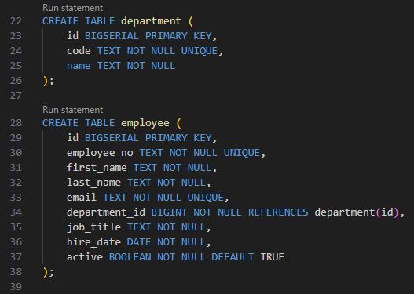

# DB Explorer (VS Code Extension)

VS Code extension for working with databases.

Currently only PostgreSQL is supported.

## Screenshots

### Data Editor


### Statement CodeLens




### Activity Bar


## Configuration

Create a profile from the Command Palette with `DB Explorer: Add Connection`, or add profiles manually to your user or workspace settings:

```json
"dbExplorer.profiles": [
  {
    "id": "local",
    "label": "Local Postgres",
    "engine": "postgres",
    "host": "localhost",
    "port": 5432,
    "database": "postgres",
    "user": "postgres"
  }
]
```

When connecting, the extension will prompt for a password and store it in VS Code SecretStorage.

## Running a Query

- Connect via Command Palette: `DB Explorer: Connect`
- Open a SQL file and place the cursor in a statement (or select SQL)
- Use the `Run statement` CodeLens to run a single SQL statement directly from the editor
- Run `DB Explorer: Run Query` to see results in a webview
- Use the Cancel button in the results panel to stop long-running queries

## Managing Stored Passwords

- Run `DB Explorer: Clear Stored Password` to remove a saved password
